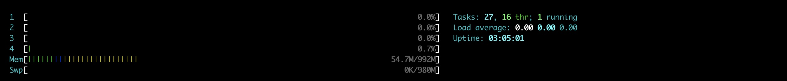
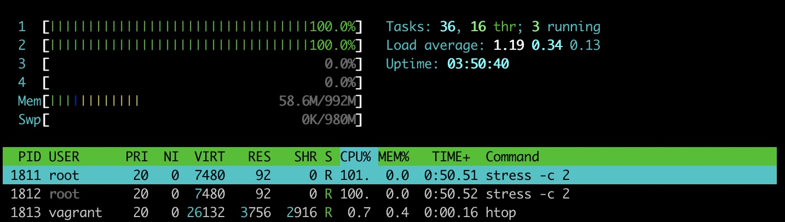
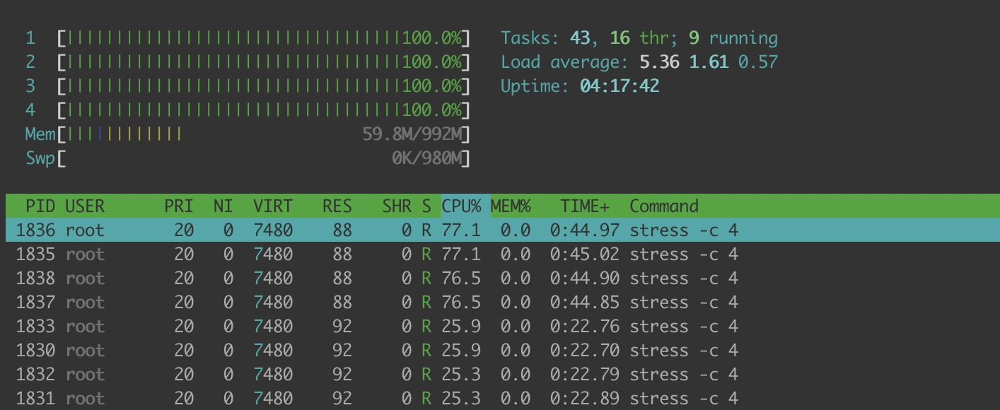
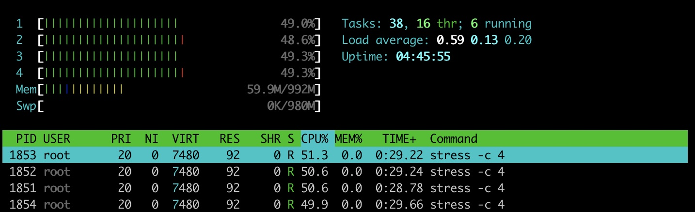
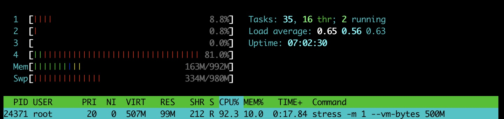

# container-from-scratch
build a container from scratch

## build base images

- https://docs.docker.com/develop/develop-images/baseimages/
- https://github.com/moby/moby/blob/master/contrib/mkimage/busybox-static

setup rootfs
```
vagrant up
vagrant ssh
chmod +x busybox-static
./busybox-static myrootfs
```

create an isolated rootfs with chroot
```bash
vagrant@vagrant:/vagrant$ sudo chroot myrootfs/ bin/sh


BusyBox v1.22.1 (Ubuntu 1:1.22.0-15ubuntu1.4) built-in shell (ash)
Enter 'help' for a list of built-in commands.

/ #
```

## linux namespace

- https://lwn.net/Articles/531114/
- http://www.haifux.org/lectures/299/netLec7.pdf
- http://www.sel.zju.edu.cn/?p=556

example
```bash
# Establish a PID namespace, ensure we're PID 1 in it against newly mounted procfs instance.
vagrant@vagrant:~$ sudo unshare --fork --pid --mount-proc readlink /proc/self
1
# Establish a user namespace as an unprivileged user with a root user within it.
vagrant@vagrant:~$ unshare --map-root-user --user sh -c whoami
root
# Establish a persistent UTS namespace, modify hostname. The namespace maybe later entered by nsenter. The namespace is destroyed by umount the bind reference.
vagrant@vagrant:~$ sudo touch /root/uts-ns
vagrant@vagrant:~$ sudo unshare --uts=/root/uts-ns
root@vagrant:~# hostname foo
root@vagrant:~# exit
logout
vagrant@vagrant:~$ sudo nsenter --uts=/root/uts-ns hostname
foo
```

create an isolated container environment using linux namespace
```bash
# create an isolated environment, container network is worth discussing separately
vagrant@vagrant:/vagrant$ sudo unshare --uts --mount --pid --uts --fork
root@vagrant:/vagrant# pstree
systemd-+-VBoxService-+-{automount}
        |             |-{control}
        ...
        |-sshd---sshd---sshd---bash---sudo---unshar
# view current process id
root@vagrant:/vagrant# echo $$
1
root@vagrant:/vagrant# ls
README.md  Vagrantfile  busybox-static  myrootfs
root@vagrant:/vagrant# sudo chroot myrootfs/ bin/sh

BusyBox v1.22.1 (Ubuntu 1:1.22.0-15ubuntu1.4) built-in shell (ash)
Enter 'help' for a list of built-in commands.

# the generated rootfs does not have /proc /sys, created manually
/ # ps -ef
PID   USER     COMMAND
ps: can't open '/proc': No such file or directory
/ # ls
bin   sbin  usr
/ # mkdir -p /proc
/ # /bin/mount -t proc proc /proc
# ps -ef only see your own process information
/ # ps -ef
PID   USER     COMMAND
    1 0        -bash
   13 0        sudo chroot myrootfs/ bin/sh
   14 0        bin/sh
   21 0        {exe} ps -ef
```

## linux cgroup

 - [RESOURCE MANAGEMENT GUIDE](https://access.redhat.com/documentation/zh-cn/red_hat_enterprise_linux/6/html/resource_management_guide/ch01#sec-How_Control_Groups_Are_Organized)

install cgroup binary and stress, htop for testing cgroup
```bash
# cgroup-bin contains cgroup-related binaries
# stress - tool to impose load on and stress test systems
# Htop is a free (GPL) ncurses-based process viewer for Linux.
apt-get install -y cgroup-bin stress htop
```

basic command usage
```bash
# show cgroups hierarchy info
vagrant@vagrant:/vagrant$ cat /proc/cgroups
#subsys_name	hierarchy	num_cgroups	enabled
cpuset	3	2	1
cpu	8	68	1
cpuacct	8	68	1
blkio	4	67	1
memory	7	98	1
devices	9	67	1
freezer	10	1	1
net_cls	6	1	1
perf_event	11	1	1
net_prio	6	1	1
hugetlb	2	1	1
pids	5	68	1
# list subsys mount point
vagrant@vagrant:/vagrant$ lssubsys -am
cpuset /sys/fs/cgroup/cpuset
cpu,cpuacct /sys/fs/cgroup/cpu,cpuacct
blkio /sys/fs/cgroup/blkio
memory /sys/fs/cgroup/memory
devices /sys/fs/cgroup/devices
freezer /sys/fs/cgroup/freezer
net_cls,net_prio /sys/fs/cgroup/net_cls,net_prio
perf_event /sys/fs/cgroup/perf_event
hugetlb /sys/fs/cgroup/hugetlb
pids /sys/fs/cgroup/pids
# list cgroup
vagrant@vagrant:/vagrant$ lscgroup
```

### cpuset
cpuset can specify which cpu the application is scheduled to

use htop to view current cpu information



```bash
# create cpu-affinity cgroup
root@vagrant:/home/vagrant# cgcreate -g cpuset:/cpu-affinity
# get cpu-affinity
root@vagrant:/home/vagrant# cgget /cpu-affinity -g cpuset
/cpu-affinity:
cpuset.mem_hardwall: 0
cpuset.cpus:
cpuset.mems:
cpuset.sched_relax_domain_level: -1
cpuset.memory_pressure: 0
cpuset.memory_spread_page: 0
cpuset.memory_spread_slab: 0
cpuset.cpu_exclusive: 0
cpuset.mem_exclusive: 0
cpuset.effective_cpus:
cpuset.effective_mems:
cpuset.sched_load_balance: 1
cpuset.memory_migrate: 0
# set cpuset
root@vagrant:/home/vagrant# echo 0-1 > /sys/fs/cgroup/cpuset/cpu-affinity/cpuset.cpus

# Some subsystems have mandatory parameters that must be set before you can move a task into a cgroup which uses any of those subsystems. For example, before you move a task into a cgroup which uses the cpuset subsystem, the cpuset.cpus and cpuset.mems parameters must be defined for that cgroup.
root@vagrant:/home/vagrant# cgexec -g cpuset:cpu-affinity stress -c 2
cgroup change of group failed
# set cpuset.mems
root@vagrant:/home/vagrant# echo 0 > /sys/fs/cgroup/cpuset/cpu-affinity/cpuset.mems
# get cpu-affinity
root@vagrant:/home/vagrant# cgget /cpu-affinity -g cpuset
/cpu-affinity:
cpuset.mem_hardwall: 0
cpuset.cpus: 0-1
cpuset.mems: 0
cpuset.sched_relax_domain_level: -1
cpuset.memory_pressure: 0
cpuset.memory_spread_page: 0
cpuset.memory_spread_slab: 0
cpuset.cpu_exclusive: 0
cpuset.mem_exclusive: 0
cpuset.effective_cpus: 0-1
cpuset.effective_mems: 0
cpuset.sched_load_balance: 1
cpuset.memory_migrate: 0
root@vagrant:/home/vagrant# cgexec -g cpuset:cpu-affinity stress -c 2
stress: info: [1810] dispatching hogs: 2 cpu, 0 io, 0 vm, 0 hdd
```

use htop to view current cpu usage


### cpushare && cpuquota

- Completely Fair Scheduler (CFS) — a proportional share scheduler which divides the CPU time (CPU bandwidth) proportionately between groups of tasks (cgroups) depending on the priority/weight of the task or shares assigned to cgroups. For more information about resource limiting using CFS, refer to Section 3.2.1, “CFS Tunable Parameters”.
- Real-Time scheduler (RT) — a task scheduler that provides a way to specify the amount of CPU time that real-time tasks can use. For more information about resource limiting of real-time tasks, refer to Section 3.2.2, “RT Tunable Parameters”.


cpushare assigns cpu based on weights. The higher the setting, the more you can use, but you can not limit the use of cpu.

cpuset example
```bash
# create cpu-share group
root@vagrant:/sys/fs/cgroup/cpu# cgcreate -g cpu:/cpu-share
root@vagrant:/sys/fs/cgroup/cpu# cgget /cpu-share -g cpu
/cpu-share:
cpu.shares: 1024
cpu.cfs_quota_us: -1
cpu.stat: nr_periods 0
	nr_throttled 0
	throttled_time 0
cpu.cfs_period_us: 100000
# create cpu-share2 group
root@vagrant:/sys/fs/cgroup/cpu# cgcreate -g cpu:/cpu-share2
root@vagrant:/sys/fs/cgroup/cpu# cgget /cpu-share -g cpu
/cpu-share:
cpu.shares: 1024
cpu.cfs_quota_us: -1
cpu.stat: nr_periods 0
	nr_throttled 0
	throttled_time 0
cpu.cfs_period_us: 100000
# set cpu.shares=3072
root@vagrant:/sys/fs/cgroup/cpu# cgset -r cpu.shares=3072 cpu-share2/
root@vagrant:/sys/fs/cgroup/cpu# cgget /cpu-share2 -g cpu
/cpu-share2:
cpu.shares: 3072
cpu.cfs_quota_us: -1
cpu.stat: nr_periods 0
	nr_throttled 0
	throttled_time 0
cpu.cfs_period_us: 100000
root@vagrant:/sys/fs/cgroup/cpu# cgexec -g cpu:cpu-share stress -c 4 &
root@vagrant:/sys/fs/cgroup/cpu# cgexec -g cpu:cpu-share2 stress -c 4 &
```
using htop you can see that one used 75% and the other 25% percent


cpuquota example

if the CPU is idle, set a small weight to the entire machine's cpu can be used, cpuquota can limit the use of cpu. cpu is split into 1024 timeslice, you can use the higher the cpu time, which means you can use more cpu.

cpu.cfs_quota_us/cpu.cfs_period_us equal to the cpu you can use, if cpu.cfs_quota_us < 0 equal not limit.

> 100000us = 100ms = 0.1s，0.1s cpu per second, 10%

```bash
# create cpu-limit group
root@vagrant:/sys/fs/cgroup/cpu# cgcreate -g cpu:/cpu-limit
# get cpu-limit group
root@vagrant:/sys/fs/cgroup/cpu# cgget /cpu-limit -g cpu
/cpu-limit:
cpu.shares: 1024
cpu.cfs_quota_us: -1
cpu.stat: nr_periods 0
	nr_throttled 0
	throttled_time 0
cpu.cfs_period_us: 100000
# set cpu.cfs_quota_us to 200000 
root@vagrant:/sys/fs/cgroup/cpu# cgset -r cpu.cfs_quota_us=200000 cpu-limit/
root@vagrant:/sys/fs/cgroup/cpu# cgget /cpu-limit -g cpu
/cpu-limit:
cpu.shares: 1024
cpu.cfs_quota_us: 200000
cpu.stat: nr_periods 2
	nr_throttled 0
	throttled_time 0
cpu.cfs_period_us: 100000
root@vagrant:/sys/fs/cgroup/cpu# cgexec -g cpu:cpu-limit stress -c 4
```

using htop you can see that using 4 cpus each used 50%


### memory
cpu is a compressible resource, memory is an incompressible resource, if it exceeds memory usage, cgroup oom control can kill the process or wait for the memory to be released

```bash
root@vagrant:/sys/fs/cgroup/cpu# cgcreate -g memory:/memory-limit
root@vagrant:/sys/fs/cgroup/cpu# cgget /memory-limit -g memory
# [What is the value for the cgroup's limit_in_bytes if the memory is not restricted/unlimited?](https://unix.stackexchange.com/questions/420906/what-is-the-value-for-the-cgroups-limit-in-bytes-if-the-memory-is-not-restricte)
memory.limit_in_bytes: 9223372036854771712
memory.oom_control: oom_kill_disable 0
root@vagrant:/sys/fs/cgroup/cpu# cgset -r memory.limit_in_bytes=100m memory-limit
root@vagrant:/sys/fs/cgroup/cpu# cgget /memory-limit -g memory
/memory-limit:
# 104857600 bytes = 102400 KB = 100m
memory.limit_in_bytes: 104857600
memory.oom_control: oom_kill_disable 0
# run 500m memory with stress
root@vagrant:/sys/fs/cgroup/cpu# cgexec -g memory:memory-limit stress -m 1 --vm-bytes 500M
```

physical memory can only use 100m, 400m run to virtual memory


```bash
# the default is 60, 60 means that your physical memory usage is 40% and you can use virtual memory.
root@vagrant:/sys/fs/cgroup/cpu# cgget /memory-limit -g memory | grep memory.swappiness
memory.swappiness: 60
# 0 means not using virtual memory
root@vagrant:/sys/fs/cgroup/cpu# cgset -r memory.swappiness=0 memory-limit
root@vagrant:/sys/fs/cgroup/cpu# cgget /memory-limit -g memory | grep memory.swappiness
memory.swappiness: 0
root@vagrant:/sys/fs/cgroup/cpu# cgexec -g memory:memory-limit stress -m 1 --vm-bytes 500M
stress: info: [24386] dispatching hogs: 0 cpu, 0 io, 1 vm, 0 hdd
stress: FAIL: [24386] (415) <-- worker 24387 got signal 9
stress: WARN: [24386] (417) now reaping child worker processes
stress: FAIL: [24386] (451) failed run completed in 0s
```
use dmesg to view the kernel log, you can look at the oom log
```
vagrant@vagrant:~$ dmesg
[26218.749573] Task in /memory-limit killed as a result of limit of /memory-limit
[26218.749577] memory: usage 102400kB, limit 102400kB, failcnt 11008165
[26218.749578] memory+swap: usage 0kB, limit 9007199254740988kB, failcnt 0
[26218.749579] kmem: usage 0kB, limit 9007199254740988kB, failcnt 0
[26218.749580] Memory cgroup stats for /memory-limit: cache:0KB rss:102400KB rss_huge:0KB mapped_file:0KB dirty:0KB writeback:0KB inactive_anon:32540KB active_anon:69840KB inactive_file:0KB active_file:0KB unevictable:0KB
[26218.749588] [ pid ]   uid  tgid total_vm      rss nr_ptes nr_pmds swapents oom_score_adj name
[26218.749635] [24386]     0 24386     1870      210       9       3        0             0 stress
[26218.749637] [24387]     0 24387   129871    25609      59       3        0             0 stress
[26218.749639] Memory cgroup out of memory: Kill process 24387 (stress) score 972 or sacrifice child
[26218.749663] Killed process 24387 (stress) total-vm:519484kB, anon-rss:102224kB, file-rss:212kB
```

### oom score
The OOM Killer has to select the “best” process to kill. “Best” here refers to that process which will free up maximum memory upon killing and is also least important to the system.
```bash
root@vagrant:/sys/fs/cgroup/cpu# cgexec -g memory:memory-limit stress -m 1 --vm-bytes 20M &
root@vagrant:/sys/fs/cgroup/cpu# ps -ef | grep stress
root     24409  1610  0 12:47 pts/0    00:00:00 stress -m 1 --vm-bytes 20M
root@vagrant:/sys/fs/cgroup/cpu# cat /proc/24409/oom_score
0
```
> -1000 < oom_score < 1000
the higher the oom score, the priority is to delete who
